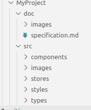

lun. 20 mars 2023 00:28:10 CET

# firestore-carousel

- Ce projet permet d'afficher un carousel d'image.
- Les images viennent de firestore.
- La configuration est dans un fichier json

# Installation

1. Cloner le repository
1. Installer les dépendances NPM : npm install
1. Copier / Coller le fichier .env en .env.local et éditer vos valeurs de configuration
1. Démarer le serveur : npm run dev

# Qu'il a t-il sous le capot ?

1. [dotenv](https://github.com/motdotla/dotenv#readme)
1. [react-router](https://github.com/remix-run/react-router#readme)
1. [styled-components](https://styled-components.com/)
1. [nanostores](https://github.com/nanostores/nanostores#readme)
1. [firebase](https://firebase.google.com/)
1. [typescript](https://www.typescriptlang.org/)
1. [vite](https://github.com/vitejs/vite/tree/main/#readme)

# Organisation du code

1. `main.tsx` : Point d'entrée de l'application
1. `src` : Dossier contenant l'intégralité du code source
1. `src/components` : Dossier contenant tout les composants react (y compris l'App)
1. `src/types` : Dossier contenant les types typescript de l'application
1. `src/stores` : Dossier contenant les actions et les états des composants
1. `src/styles` : Dossier contenant le style de l'application (styled-components)
1. `src/images` : Dossier contenant les images l'application
1. `src/lib` : Dossier contenant tout le code externe à React
